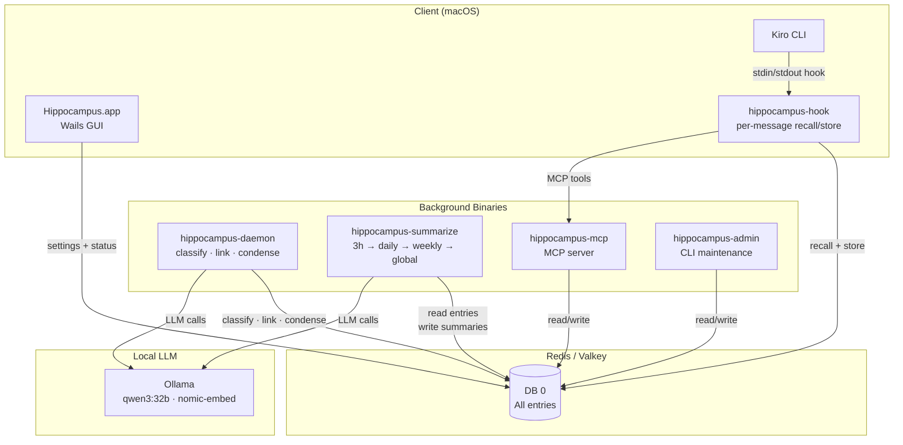
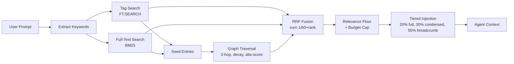
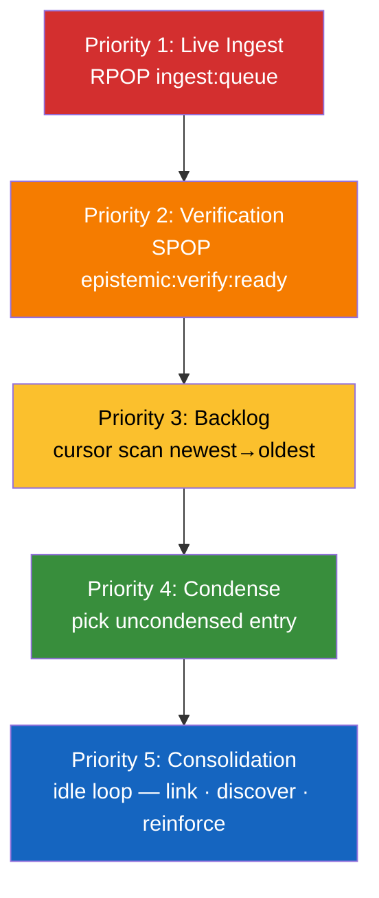
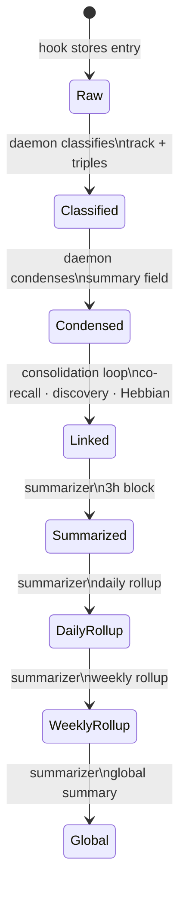
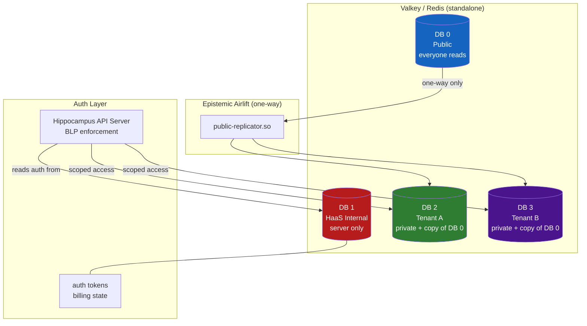
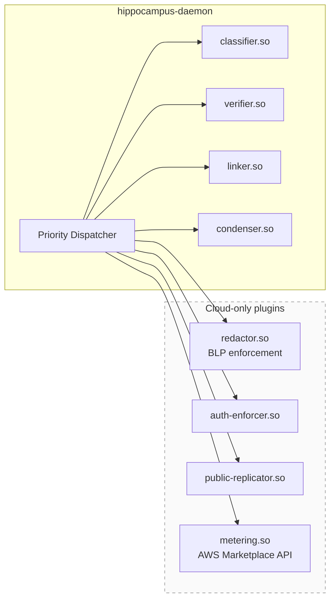
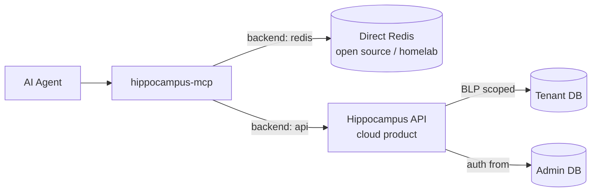
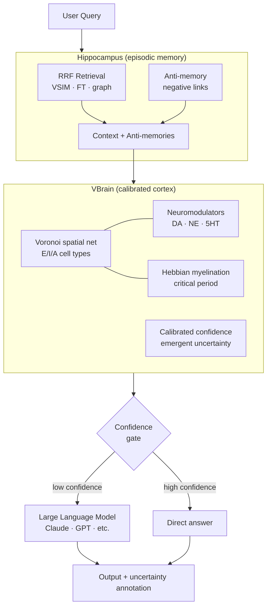
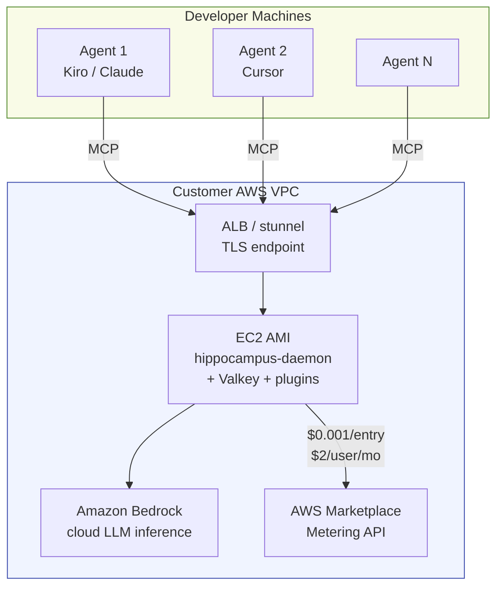

# Hippocampus Architecture

This document covers the current v2.x architecture and the planned v3 architecture.
View with VSCode Markdown Preview (Cmd+Shift+V) for rendered Mermaid diagrams.

---

## v2.x — Current Architecture

### Component Overview

### Retrieval Pipeline (Hook Recall)

### Daemon Priority Dispatcher

### Memory Entry Lifecycle

---

## v3 — Planned Architecture

### Multi-Tenant BLP Design

**BLP invariant (structural, not policy):**
- DB 0 → DB N: ✅ allowed (airlift)
- DB N → DB 0: ❌ impossible (no write path)
- DB N → DB M: ❌ impossible (no cross-tenant path)

### Plugin Architecture

### MCP Backend Modes

### Complete Hybrid Inference Pipeline (VBrain integration)

### AWS Marketplace AMI

---

## Key Design Principles

| Principle | Implementation |
|---|---|
| No magic numbers | All tunables in config.json with defaults |
| Boring technology | Single Valkey instance, no vector DB |
| Structural not policy | BLP via DB numbers, not query filters |
| Additive only | Graph channel never degrades recall |
| Biological inspiration | Sleep consolidation, spreading activation, Hebbian learning |
| One-way information flow | Public → tenant airlift, never reversed |
