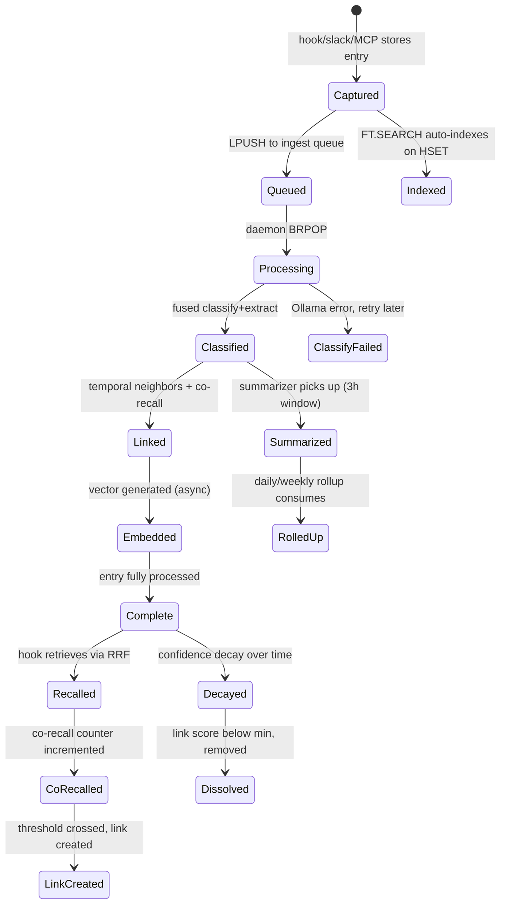
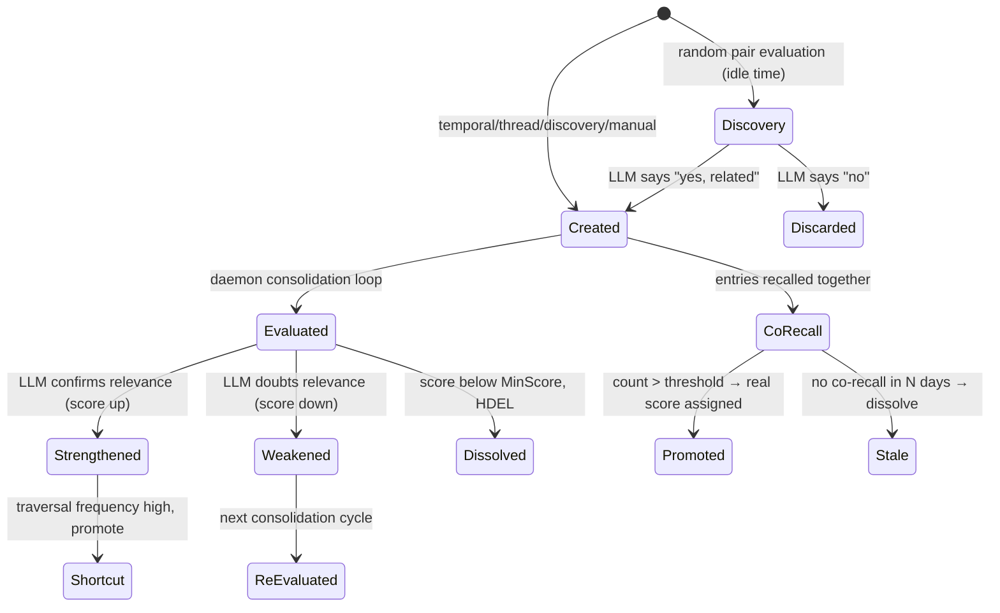
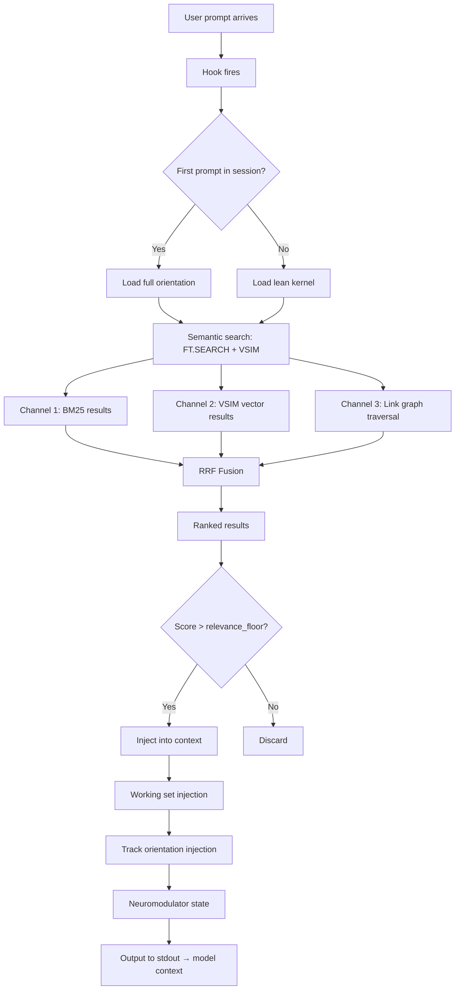
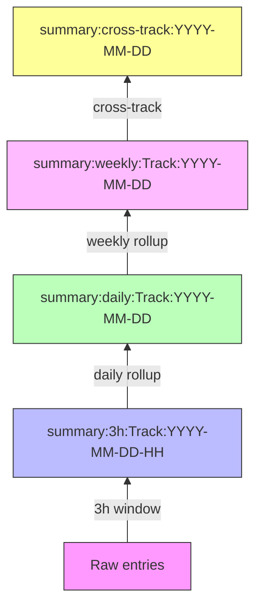
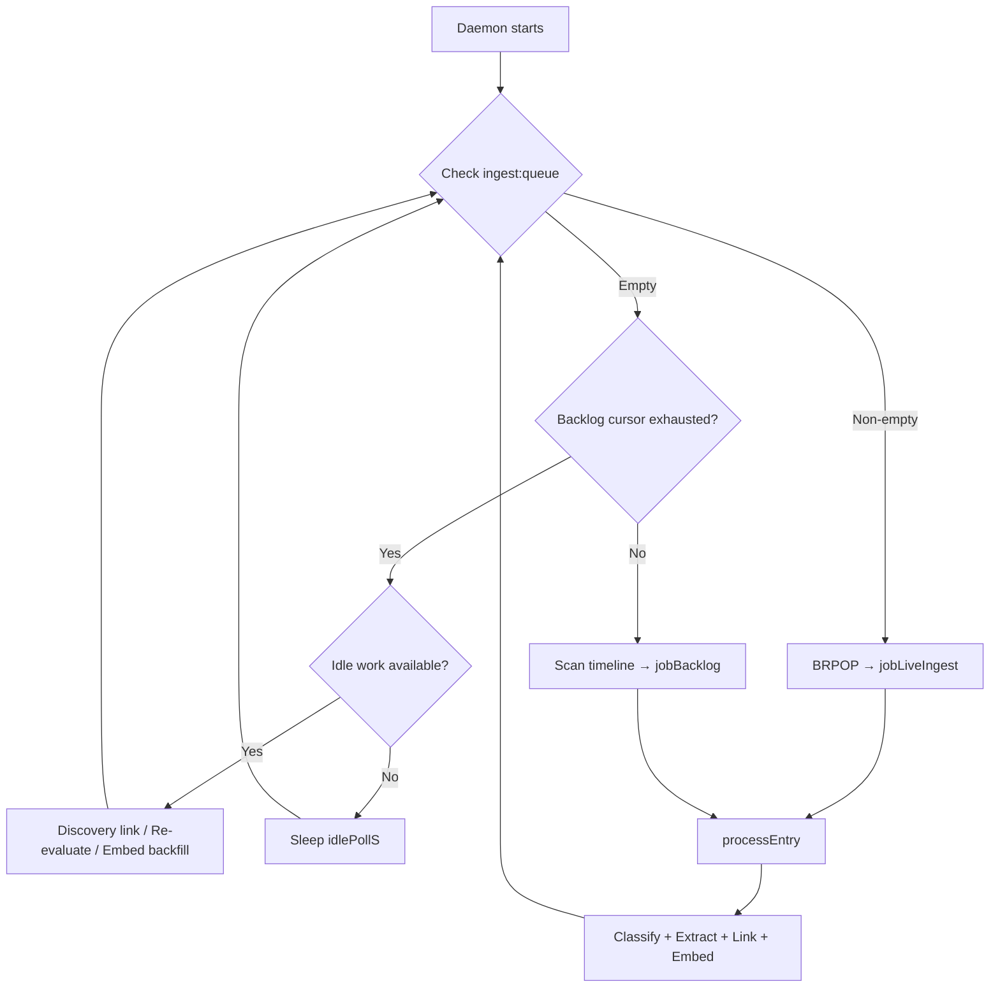

# Hippocampus Redis Schema Reference (v2.x)

This document captures the current Redis data model as a reference for v3 spec development.

## Key Namespace Map

| Pattern | Type | Purpose |
|---------|------|---------|
| `entry:<id>` | HASH | Core entry storage (content, tags, timestamp, summary) |
| `tag:<tagname>` | SET | Entry IDs that have this tag |
| `tags:all` | SET | All tag names that exist |
| `timeline` | ZSET | All entry IDs, scored by Unix timestamp |
| `links:<id>` | HASH | Associative links (field=targetID, value="score\|type") |
| `hippocampus:vectors` | VSET | Vector embeddings (FP32, keyed by entry ID) |
| `ingest:queue` | LIST | Live ingest queue for daemon (LPUSH/BRPOP) |
| `meta:slack:backfill:<channelID>` | STRING | Backfill cursor (Slack ts or "done") |
| `meta:track-manifests` | HASH | Track classifier manifests (field=content, JSON map) |
| `daemon:last_processed` | STRING | Unix ts of last daemon activity |
| `daemon:last_entry_id` | STRING | Last entry ID processed by daemon |
| `corecall:<idA>:<idB>` | STRING | Co-recall counter (int, incremented on co-occurrence) |

## Entry HASH Fields

```
entry:<id>
├── id        : string   (entry ID, same as key suffix)
├── content   : string   (the actual text)
├── tags      : string   (comma-separated tag list)
├── timestamp : int64    (Unix seconds)
└── summary   : string   (optional: condensed version from daemon)
```

## Link HASH Fields

```
links:<id>
├── <targetID_1> : "0.7500|extends"     (score|type)
├── <targetID_2> : "0.8500|supports"
├── <targetID_3> : "-0.5000|contradicts"
└── <targetID_N> : "0.0000|corecall"    (unscored, pending evaluation)
```

Link types: `corecall`, `legacy`, `overflow`, `thread`, `cross-track`, `imported`, `extends`, `supports`, `contradicts`, `preceded_by`, `manual`, `discovery`, `temporal`

## Tag Taxonomy

```
track:<Name>           — Manual track assignment
track_auto:<Name>      — Classifier-assigned track
summary:3h:<Name>      — 3-hour summary for track
summary:daily:<Name>   — Daily summary for track
summary:weekly:<Name>  — Weekly summary for track
summary:cross-track    — Cross-track connection summaries
summary:comprehensive  — Full orientation entries
kind:prompt            — Bulk-ingested user prompts
kind:assistantmessage  — Bulk-ingested assistant responses
kind:user_prompt       — Hook-captured user prompts (recent)
kind:assistant_response — Hook-captured assistant responses (recent)
kind:reasoning         — Decision breadcrumbs
auto:captured          — Auto-captured by hook this session
session:<uuid>         — Session scope
date:YYYY-MM-DD        — Temporal
cwd:<path>             — Working directory context
person:<name>          — People-related entries
source:slack           — Slack-ingested entries
source:web             — Web-ingested entries
content:slack          — Content type marker
slack:channel:<id>     — Slack channel ID
slack:channel_name:<n> — Slack channel display name
slack:user:<id>        — Slack user ID
slack:user_name:<n>    — Slack user display name
slack:thread:<ts>      — Thread grouping
safety:flagged         — Safeguard scanner flagged
meta                   — System/orientation entries
orientation            — Orientation entries
lean-kernel            — Lean kernel entry
classified             — Entry has been classified
classified:auto        — Classification was automatic
classified:confused    — Classifier was uncertain
```

## State Diagrams

### Entry Lifecycle



### Link Lifecycle



### Recall Flow (Hook)



### Summarization Hierarchy



### Daemon Priority Dispatch



## v3 Schema Considerations

- **Config versioning:** Store schema version in DB 1 (`schema:version`)
- **Namespace isolation:** Key prefix per tenant (`t:<tenantID>:entry:<id>`)
- **Bi-temporal:** Add `valid_from`/`valid_until` fields for fact evolution
- **Confidence field:** Float on entry HASH, decayed by summarizer
- **Stale tracking:** Tag `stale` on summaries whose sources changed
- **Source provenance:** `sources` field on summary entries (comma-separated IDs consumed)
